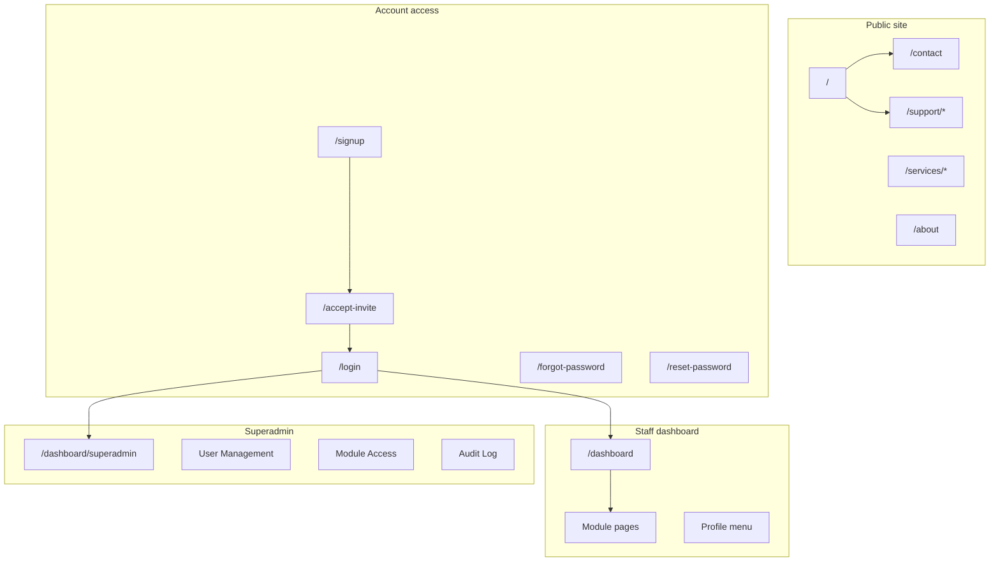

# RTA Services Customer User Guide (Markdown)

## Deliverable

One handover-ready document: **[docs/USER_GUIDE.md](docs/USER_GUIDE.md)**

Optional supporting folder for future screenshots: **`docs/images/user-guide/`** (README only listing expected filenames; no binary assets in this pass unless you add them later).

Tone: professional, second-person (“you”), non-technical where possible. Written for RTA staff and administrators using the deployed site (not for developers).

Production URL to reference throughout: `https://rta.arwindpianist.com` (from [app/layout.tsx](app/layout.tsx) `metadataBase`), with a short note that the customer’s live domain may differ.

---

## Document structure (table of contents)



### 1. Introduction
- What the site is (public marketing + authenticated operations dashboard).
- Who should read which sections (visitor, new staff, finance/sales roles, superadmin).
- Browser requirements and recommended desktop use for dashboard tables/charts.

### 2. Public website navigation
Source: [components/Navbar.tsx](components/Navbar.tsx), [components/ConditionalShell.tsx](components/ConditionalShell.tsx), route list under `app/`.

| Area | Routes | What to document |
|------|--------|------------------|
| Main nav | `/`, `/about`, `/contact` | Header links, mobile drawer, logo returns home |
| Services | `/services`, `/services/tpm`, `/services/oss`, `/services/ps` | Services dropdown (desktop) vs flat list (mobile) |
| Contact | `/contact` | Message vs quote form (`?form=quote` via [app/contact/page.tsx](app/contact/page.tsx)) |
| Support (public) | `/support`, `/support/contact`, `/support/status`, `/support/request`, `/support/thank-you` | Three support paths from [app/support/page.tsx](app/support/page.tsx) |
| Footer / CTAs | Sticky CTA, breadcrumbs | Brief mention of sitewide chrome |

**Screenshot placeholders** (examples):
- `docs/images/user-guide/01-public-home.png`
- `02-public-services-menu.png`
- `03-public-contact-quote.png`
- `04-public-support-hub.png`

### 3. Getting access (invite-only accounts)
Source: [app/signup/page.tsx](app/signup/page.tsx), [app/accept-invite/page.tsx](app/accept-invite/page.tsx), [app/login/page.tsx](app/login/page.tsx), [app/forgot-password/page.tsx](app/forgot-password/page.tsx), [app/reset-password/page.tsx](app/reset-password/page.tsx).

Step-by-step flows:
1. **No self-service registration** — accounts are created by superadmin invite only (`/signup` explains paste-invite-link flow).
2. **Accept invitation** — open email link → `/accept-invite?token=...` → set name and password (min 8 chars).
3. **Sign in** — `/login` → redirects to `/dashboard` on success.
4. **Forgot / reset password** — `/forgot-password` → email link → `/reset-password?token=...`.

**Screenshot placeholders**: invite email (redacted), accept-invite form, login, forgot/reset screens.

### 4. Staff dashboard (default experience)
Source: [app/dashboard/layout.tsx](app/dashboard/layout.tsx), [components/dashboard/DashboardHeader.tsx](components/dashboard/DashboardHeader.tsx), [app/dashboard/page.tsx](app/dashboard/page.tsx).

#### 4.1 Entering the dashboard
- Direct URL: `/dashboard`
- Unauthenticated users are sent to `/login` with return URL (middleware in [middleware.ts](middleware.ts)).
- **Gold header**: breadcrumbs, greeting, profile menu (settings, help request, log out).

#### 4.2 Main dashboard home (`/dashboard`)
Document:
- KPI cards (win rate, pipeline, totals).
- Period filters (This Week / Month / Quarter / YTD).
- Top opportunities table (row click → detail modal).
- Advanced filters panel.
- Data refresh behavior (stale data warning, blurred “refreshing” state).
- **Quick access** buttons (module-gated; list from [app/dashboard/page.tsx](app/dashboard/page.tsx) ~lines 456–528).

#### 4.3 Module pages (navigation paths + purpose)
Use [docs/dashboard-completion-matrix.md](docs/dashboard-completion-matrix.md) to label each as **Live**, **Partial**, or **Preview** so customer expectations are honest.

| Route | User-facing name | Notes for guide |
|-------|------------------|-----------------|
| `/dashboard/finances` | Finances hub | Role: master financials |
| `/dashboard/finances/invoices`, `/bills`, `/payments`, `/claims`, `/statements` | Finance sub-pages | Call out mock/preview where matrix says Pending |
| `/dashboard/receivables` | Receivables | Zoho + Xero |
| `/dashboard/quote-to-cash` | Quote-to-cash | Connector workflow |
| `/dashboard/quote-payments` | Quote payments | Zoho–Xero payment tracking |
| `/dashboard/customers`, `/customers/[id]` | Customers | List + detail |
| `/dashboard/sales-forecast` | Sales forecast | Preview if still mock |
| `/dashboard/sales-leaderboard` | Sales leaderboard | Live Zoho |
| `/dashboard/payroll` | Payroll | Restricted roles |
| `/dashboard/hrm` | HRM | Placeholder/MVP |
| `/dashboard/settings/connector` | Session & connector settings | Profile menu entry |
| `/dashboard/support` | Private help requests | In-app support (staff) |
| `/dashboard/connector/reconciliation` | Reconciliation | Manual linking |
| `/dashboard/presentation` | Presentation mode | If documented in UI |

**Screenshot placeholders**: dashboard home, quick access, finances hub, quote-to-cash, profile menu.

#### 4.4 Roles and what you may see
Source: [lib/rbac.ts](lib/rbac.ts), [lib/module-access.ts](lib/module-access.ts).

Explain in plain language:
- **Roles**: `staff`, `chris`, `craig`, `arnaud`, `superadmin` (use display names, not internal IDs).
- **Two layers**: role capabilities (payroll, master financials, HRM) + per-module permissions (view/edit/admin).
- Why some Quick access buttons or pages may be missing.
- **Presentation mode** (URL `?presentation=true` / session behavior from [app/dashboard/DashboardPresentationContext.tsx](app/dashboard/DashboardPresentationContext.tsx)) — simplified view for certain roles.

### 5. Superadmin console
Source: [app/dashboard/superadmin/page.tsx](app/dashboard/superadmin/page.tsx), [components/dashboard/SuperadminHeader.tsx](components/dashboard/SuperadminHeader.tsx), [middleware.ts](middleware.ts) (superadmin route isolation).

Document:
- Superadmin lands on `/dashboard/superadmin` (not main business dashboard).
- Nav: Overview, User Management, Module Access, Audit Log, Support Queue, Quote Payments.
- **User Management** ([app/dashboard/superadmin/users/page.tsx](app/dashboard/superadmin/users/page.tsx)): invites (single/bulk), roles, enable/disable, reset links, invitation table.
- **Module Access**: role matrix and toggles ([app/dashboard/superadmin/module-access/page.tsx](app/dashboard/superadmin/module-access/page.tsx)).
- **Audit Log**: filter by user, activity type, date **DDMMYYYY** ([app/dashboard/superadmin/audit/page.tsx](app/dashboard/superadmin/audit/page.tsx)).
- **Support Queue**: private staff requests ([app/dashboard/superadmin/support/page.tsx](app/dashboard/superadmin/support/page.tsx)).
- **Tenant admin** route `/dashboard/admin/users` (alias-style access; note superadmin-only).

**Screenshot placeholders**: superadmin overview, user management, audit log table, module access matrix.

### 6. Support: public vs authenticated
| Channel | Where | Audience |
|---------|-------|----------|
| Public enquiry | `/support/contact` | Anyone |
| Ticket status | `/support/status` | Anyone with ticket ref |
| OSS request | `/support/request` | Anyone |
| Private help | `/dashboard/support` | Signed-in staff |

Clarify these are different queues (public Zoho vs private Neon-backed queue for superadmin).

### 7. Operations and troubleshooting (customer-facing)
- **Maintenance / dashboard shutdown**: `DISABLE_AUTHENTICATED_ROUTES` behavior from [lib/authenticated-routes.ts](lib/authenticated-routes.ts) — public site stays up; `/login` and `/dashboard` redirect home with message.
- **Session issues**: log out from profile menu, clear cookies, sign in again.
- **Invite expired / revoked**: contact administrator for new invite.
- **Xero connection**: high-level note that connector settings live under profile → Manage Session & Settings (no secrets in doc).

### 8. Appendices
- **A. URL quick reference** — full route table (public + auth + dashboard).
- **B. Glossary** — Zoho, Xero, pipeline, quote-to-cash, receivables, etc.
- **C. Document history** — version, date, prepared for customer delivery.

---

## Screenshot placeholder convention

Each placeholder block in the MD file will follow a consistent pattern:

```markdown
> **Screenshot placeholder:** [Short title]
> Save as: `docs/images/user-guide/NN-slug.png`
> Capture: [what should be visible in the frame]
```

Number placeholders sequentially across the guide (01–20+).

---

## What we will not include (out of scope for user guide)

- Internal env var setup, Neon schema, Vercel deploy, API route specs (keep in existing [docs/](docs/) dev/roadmap files).
- Copying entire [docs/dashboard-completion-matrix.md](docs/dashboard-completion-matrix.md) — only summarize user-visible maturity in a short table.

---

## Implementation steps

1. Create `docs/images/user-guide/README.md` listing all placeholder filenames and titles.
2. Write `docs/USER_GUIDE.md` with full TOC, mermaid site map, and all sections above.
3. Cross-check every documented URL against `app/**/page.tsx` routes and middleware rules so superadmin vs staff paths are accurate.
4. Add a one-line link from [README.md](README.md) under documentation pointing to the user guide for discoverability.
5. Quick proofread: invite-only flow, DDMMYYYY audit dates, log out path, role-gated quick access.

---

## Success criteria

- Customer can follow the guide without reading source code.
- Clear path: **public pages → get invite → login → dashboard → modules → superadmin (if applicable)**.
- Screenshot placeholders are numbered and tied to concrete filenames for your team to capture post-deploy.
- Honest labeling of preview/mock modules avoids support surprises.
