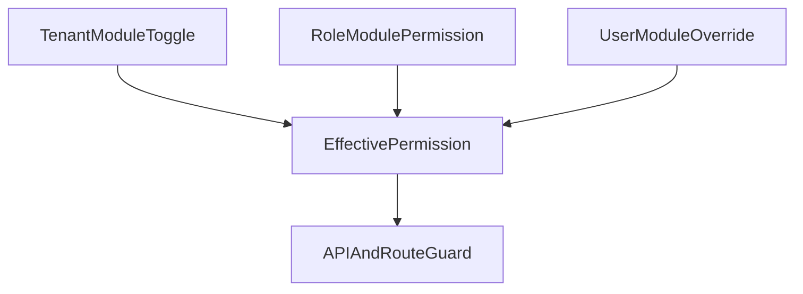

# Granular Module Access Control Plan

## Goal

Introduce true module-level permission management (beyond static role/person checks), so superadmin can control access by module and action for each role/user from the console.

## Current Baseline

- Static role capability map in [c:\Users\arwin\Desktop\ADPMC\rtaservices\lib\rbac.ts](c:\Users\arwin\Desktop\ADPMC\rtaservices\lib\rbac.ts)
- Session user + capability resolution in [c:\Users\arwin\Desktop\ADPMC\rtaservices\lib\auth-session.ts](c:\Users\arwin\Desktop\ADPMC\rtaservices\lib\auth-session.ts)
- Admin-protected APIs using `canManageUsers` checks under [c:\Users\arwin\Desktop\ADPMC\rtaservices\app\api\admin(c:\Users\arwin\Desktop\ADPMC\rtaservices\app\api\admin
- Superadmin route guard in [c:\Users\arwin\Desktop\ADPMC\rtaservices\middleware.ts](c:\Users\arwin\Desktop\ADPMC\rtaservices\middleware.ts)
- Existing Neon schema/migrations in [c:\Users\arwin\Desktop\ADPMC\rtaservices\lib\neon-schema.ts](c:\Users\arwin\Desktop\ADPMC\rtaservices\lib\neon-schema.ts)

## Implementation Steps

### 1) Extend Neon schema for policy storage

Add policy tables to [c:\Users\arwin\Desktop\ADPMC\rtaservices\lib\neon-schema.ts](c:\Users\arwin\Desktop\ADPMC\rtaservices\lib\neon-schema.ts):

- `access_modules` (module catalog: key, label, enabled)
- `role_module_permissions` (role defaults per module/action)
- `user_module_overrides` (per-user overrides)
- `tenant_module_toggles` (global module on/off)

Also add indexes/unique constraints for deterministic lookup and idempotent writes.

### 2) Add a policy repository/service layer

Create `lib/module-access.ts` to encapsulate:

- list modules
- get effective permissions (role defaults + user overrides + tenant toggle)
- upsert role permission rows
- upsert user overrides
- toggle modules globally
- produce normalized permission shape for server/client use

### 3) Integrate effective permissions into session access helpers

Update [c:\Users\arwin\Desktop\ADPMC\rtaservices\lib\auth-session.ts](c:\Users\arwin\Desktop\ADPMC\rtaservices\lib\auth-session.ts) to return:

- existing static capabilities (for backward compatibility)
- resolved module permissions from `module-access` service

This keeps current code working while enabling gradual migration.

### 4) Add superadmin APIs for module policy management

Add endpoints under [c:\Users\arwin\Desktop\ADPMC\rtaservices\app\api\admin(c:\Users\arwin\Desktop\ADPMC\rtaservices\app\api\admin:

- `GET/PUT /api/admin/module-access/roles`
- `GET/PUT /api/admin/module-access/users`
- `GET/PUT /api/admin/module-access/modules`

All endpoints:

- require `canManageUsers`
- write audit events via existing audit utilities in `lib/users.ts`

### 5) Add superadmin Module Access UI

Add new page and navigation entry:

- `app/dashboard/superadmin/module-access/page.tsx`
- update [c:\Users\arwin\Desktop\ADPMC\rtaservices\components\dashboard\SuperadminHeader.tsx](c:\Users\arwin\Desktop\ADPMC\rtaservices\components\dashboard\SuperadminHeader.tsx)

UI sections:

- Module toggles (global enable/disable)
- Role permission matrix (view/edit/admin or boolean actions)
- User overrides table (search by email/name, override per module)
- Save/apply actions with audit feedback

### 6) Enforce module permissions in selected APIs and routes (phase 1)

Start with high-value surfaces:

- pipeline draft routes under `app/api/pipeline-drafts/*`
- dashboard finance/sales endpoints under `app/api/dashboard/*`

Use a single helper guard (in `lib/module-access.ts`) so enforcement is consistent and easy to roll out module-by-module.

### 7) Add migration/backfill defaults

On bootstrap:

- seed `access_modules`
- map existing `rbac.ts` capabilities into default role-module permissions
- preserve current behavior until explicit policy edits happen

### 8) Validation and rollout

- Add unit/integration coverage for effective permission resolution and precedence rules.
- Verify no regressions for existing roles.
- Roll out enforcement incrementally (start read-only checks/logging, then enforce deny).

## Permission Precedence Model

Priority:

1. Tenant toggle deny (hard stop)
2. User override
3. Role default
4. Fallback deny

## Deliverables

- Schema + seed updates
- Module access repository + resolver
- Superadmin management APIs
- Superadmin module access page
- Phase-1 guarded APIs
- Audit logs for all policy changes

