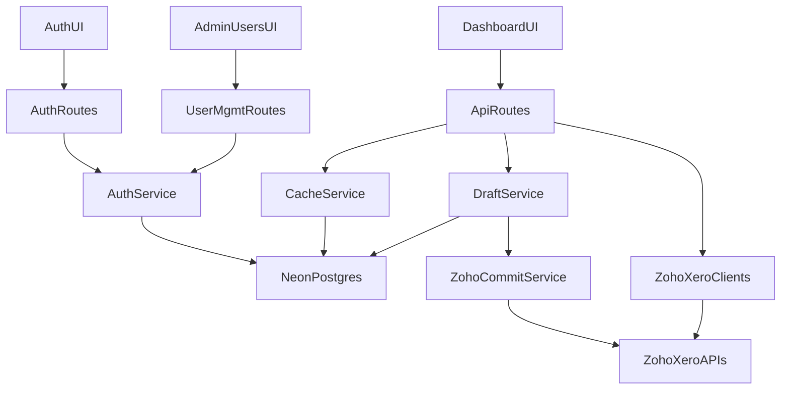

# Neon Cache, Drafts, and Auth Rollout

## Goals

- Reduce external Zoho/Xero API usage with Neon-backed cache.
- Add draft-first pipeline editing in dashboard, then commit to Zoho when complete.
- Add secure app auth with role-based access and a private superadmin model.

## Architecture

## Data Model (Neon Postgres)

- `users`: id, email, password_hash, role, is_active, created_at, updated_at.
- `sessions`/`verification` tables for Auth.js adapter.
- `cache_entries`: key, scope, payload_json, etag, expires_at, updated_at.
- `pipeline_drafts`: id, zoho_quote_id, author_user_id, payload_json, status, source_modified_time, committed_at, created_at, updated_at.
- `pipeline_draft_events` (optional audit): draft_id, event_type, before_json, after_json, actor_user_id, created_at.
- `integration_links` (migrate from file store): quote_id, invoice_id, status, paid_at, updated_at.
- `xero_tokens` (migrate from file store): tenant_id, access_token_encrypted, refresh_token_encrypted, expires_at, updated_at.

## Backend Changes

- Add Neon DB client and repository layer in `lib`.
- Introduce read-through cache wrapper around expensive endpoints:
  - `app/api/zoho/opportunities/route.ts`
  - `app/api/connector/pipeline/route.ts`
  - `app/api/connector/receivables/route.ts`
  - `app/api/dashboard/finances/summary/route.ts`
  - `app/api/dashboard/finances/invoices/route.ts`
  - `app/api/dashboard/sales-forecast/route.ts`
- Add invalidation on write/sync routes:
  - `app/api/connector/create-invoice/route.ts`
  - `app/api/connector/link/route.ts`
  - `app/api/connector/sync/route.ts`
- Add draft API routes:
  - `app/api/pipeline-drafts/route.ts`
  - `app/api/pipeline-drafts/[id]/route.ts`
  - `app/api/pipeline-drafts/[id]/commit/route.ts`
- Reuse/extend Zoho update logic in `lib/zoho-quote-update.ts` for commit operation with optimistic checks.

## Auth and User Management

- Implement Auth.js with Neon Postgres adapter in Next.js app routes.
- Add login/signup pages and protected dashboard middleware.
- Create one private superadmin account: `admin@rtaservices.net` (seeded out-of-band).
- Build admin-only user management page to:
  - create user accounts,
  - generate one-time credentials/reset links with copy action,
  - edit role/status,
  - delete/deactivate users.
- Enforce that superadmin identity is not exposed in user-facing directory/listing responses.

## UI Changes

- Update `app/dashboard/quote-to-cash/page.tsx` with draft edit mode (save draft, resume, submit for commit).
- Optionally add lightweight draft indicators in `app/dashboard/page.tsx` for opportunities with pending draft changes.
- Add `/dashboard/admin/users` for user management with role guards.

## Migration and Safety

- Keep current file-backed stores as fallback during transition (`lib/connector-store.ts`, `lib/xero-store.ts`).
- Add migration script to import existing `data/*.json` records into Neon tables once.
- Add feature flags to toggle cache and draft systems progressively.

## Rollout Phases

- Phase 1: Neon wiring, schema, cache for read-heavy endpoints, invalidation on writes.
- Phase 2: Draft APIs + quote-to-cash draft UI + commit to Zoho.
- Phase 3: Auth.js + role model + admin user management UI + access controls.
- Phase 4: Migrate token/link stores from local files to Neon fully, remove fallback.

## Validation

- API tests: cache hit/miss behavior, TTL expiry, invalidation correctness.
- Integration tests: draft lifecycle (`draft` -> `ready` -> `committed`) and Zoho writeback.
- Auth tests: role guards, admin-only operations, superadmin visibility restrictions.
- Load test key dashboard routes to verify reduced Zoho/Xero call counts and latency improvements.

