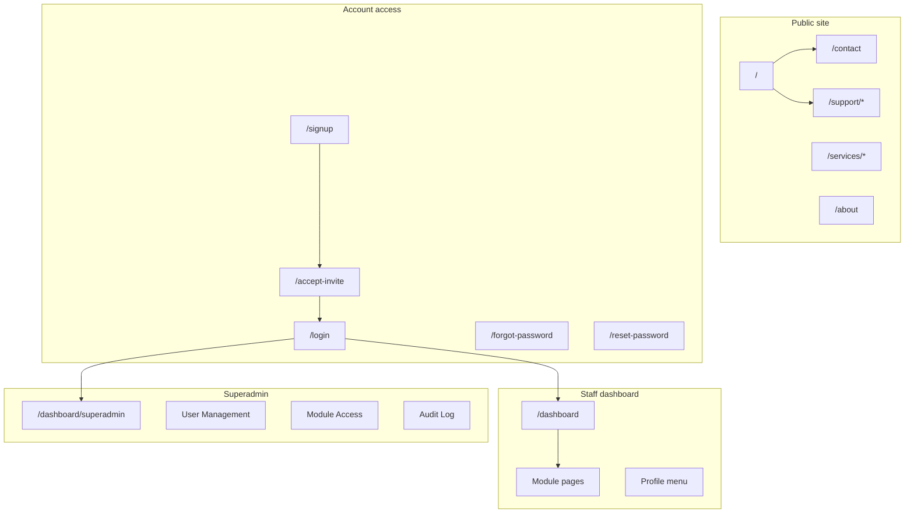

# RTA Services — User Guide

---

## Document information

| Field | Detail |
|-------|--------|
| **Document title** | RTA Services — User Guide |
| **Version** | 1.1 |
| **Status** | Customer delivery |
| **Last updated** | April 2026 |
| **Prepared for** | RTA Services and authorised staff |
| **Classification** | Customer / operational use |

### Purpose of this document

This guide explains how to use the RTA Services website from the public marketing pages through account activation, daily dashboard work, and (where applicable) system administration. It is written for end users, not developers.

### Example production URL

**https://rta.arwindpianist.com**

Your organisation may use a different hostname. Throughout this guide, paths such as `/dashboard` mean: add them to your site address (for example `https://rta.arwindpianist.com/dashboard`).

### Transferring this guide to Microsoft Word

When you copy this file into Word:

1. Open the `.md` file in an editor that supports Markdown, or paste into Word and apply heading styles to lines starting with `#`, `##`, and `###`.
2. Use Word’s **References → Table of Contents** after applying Heading 1 / 2 / 3 styles.
3. Replace each **Screenshot placeholder** block with the matching image from `docs/images/user-guide/` (see [Screenshot index](images/user-guide/README.md)).
4. The mermaid diagram in Section 1.3 may be recreated in Word using SmartArt, or replaced with the text site map in Section 1.4.
5. Tables will paste cleanly if you paste from a Markdown preview (e.g. Typora, VS Code preview) rather than raw markdown.

### Conventions used in this guide

| Convention | Meaning |
|------------|---------|
| **Bold** | User interface labels, buttons, and menu items |
| `Monospace` | URLs, paths, and technical identifiers |
| Numbered steps | Actions you perform in order |
| Note | Additional helpful context |
| Important | Security, access, or data-handling caution |

---

## Table of contents

1. [Introduction](#1-introduction)
2. [Quick start — common journeys](#2-quick-start--common-journeys)
3. [Public website](#3-public-website)
4. [Getting access — accounts and sign-in](#4-getting-access--accounts-and-sign-in)
5. [Staff dashboard](#5-staff-dashboard)
6. [Dashboard modules — detailed walkthroughs](#6-dashboard-modules--detailed-walkthroughs)
7. [Roles, permissions, and presentation mode](#7-roles-permissions-and-presentation-mode)
8. [Superadmin console](#8-superadmin-console)
9. [Support — public and in-dashboard](#9-support--public-and-in-dashboard)
10. [Operations, troubleshooting, and FAQ](#10-operations-troubleshooting-and-faq)
11. [Appendix A — URL quick reference](#appendix-a--url-quick-reference)
12. [Appendix B — Glossary](#appendix-b--glossary)
13. [Appendix C — Document history](#appendix-c--document-history)

---

## 1. Introduction

### 1.1 What the platform provides

The RTA Services web platform has two main parts:

**Public website (no login required)**

- Company information, service lines (TPM, OSS, Professional Services), and contact options.
- Public support entry points (general enquiry, ticket status, OSS support search).
- Marketing content, forms, and calls to action.

**Authenticated dashboard (login required)**

- Operational workspace for staff: sales pipeline, customer views, finance summaries, quote-to-cash workflows, and integrations with **Zoho CRM** and **Xero** (where configured).
- Private help requests visible to administrators.
- A separate **superadmin console** for user lifecycle, permissions, audit review, and internal support triage.

Data shown in the dashboard depends on your **role**, **module permissions**, and whether external systems (Zoho, Xero) are connected.

### 1.2 Who should read which sections

| Your role | Start here | Also read |
|-----------|------------|-----------|
| Visitor or prospect | Section 3 — Public website | Section 9.1 (public support) |
| New employee (first day) | Section 2 → Section 4 → Section 5 | Section 7 |
| Sales / operations staff | Section 5–6 | Section 9.2 (private help) |
| Finance / payroll / HR (if enabled) | Section 6 (Finances, Payroll, HRM) | Section 7 |
| System administrator (superadmin) | Section 8 | Section 9, Section 10 |

### 1.3 Site map (diagram)

### 1.4 Site map (text overview)

For Word or print-friendly reference:

**Public**

- Home → About, Contact, Services (TPM / OSS / PS), Support hub

**Account access (no dashboard until complete)**

- Signup (information only) → Accept invite → Login  
- Forgot password → Reset password → Login

**Staff dashboard (after login)**

- Dashboard home → Quick access to modules (Finances, Quote-to-cash, Customers, etc.)  
- Profile menu → Settings, Private help, Log out

**Superadmin (separate console)**

- Overview → User Management, Module Access, Audit Log, Support Queue, Quote Payments

### 1.5 System requirements and recommendations

| Requirement | Recommendation |
|-------------|----------------|
| Browser | Current version of Chrome, Microsoft Edge, Firefox, or Safari |
| Device | Desktop or laptop for dashboard tables and charts; mobile works for public pages |
| Cookies | Enabled so sign-in sessions persist |
| Email access | Required for invites and password reset |
| Clipboard | Used when administrators copy invite or reset links |

**Important:** Do not share your password, invite links, or reset links with others. Each link is intended for a single recipient.

---

## 2. Quick start — common journeys

Use these shortened paths; full detail appears in later sections.

### Journey A — First-time staff user

1. Receive invitation email from your administrator.
2. Open the invite link → complete **Accept invitation** (name + password).
3. Go to **Login** → enter email and password.
4. You arrive at **Dashboard home** → explore **Quick access** and **Top opportunities**.
5. Open **Profile → Manage Session & Settings** to set display preferences.

### Journey B — Returning staff user

1. Open `/login` → sign in.
2. Review **Dashboard home** for the period you need (Week / Month / Quarter / YTD).
3. Jump to the module you need (e.g. **Quote-to-cash**, **Receivables**, **Customers**).

### Journey C — Superadmin onboarding a new colleague

1. Sign in → you are directed to **Superadmin overview**.
2. Open **User Management** → **Single Invite** or **Bulk Invite**.
3. Send the invite link to the new user (link is copied to clipboard).
4. Optionally set **Module Access** for their role before they start.

### Journey D — Public visitor requesting a quote

1. Open the public site → **Contact**.
2. Switch to **Request a Quote** (or use `/contact?form=quote`).
3. Complete and submit the form → confirmation on screen.

---

## 3. Public website

You do **not** need an account to use the public website. The site shows a consistent header (logo and navigation), main content, footer, and in many cases a sticky call-to-action.

### 3.1 Header and global navigation

**Desktop layout**

1. **Logo** (top left) — click to return to the homepage (`/`).
2. **Home** — homepage.
3. **Services** — hover or click to open a menu:
   - All Services Overview → `/services`
   - Third-Party Maintenance → `/services/tpm`
   - Open Source Software (OSS) → `/services/oss`
   - Professional Services → `/services/ps`
4. **About Us** → `/about`
5. **Contact** → `/contact`

**Mobile layout**

1. Tap the **menu** (hamburger) icon.
2. The drawer lists Home, Services (and sub-links), About Us, and Contact.
3. Tap a link to navigate; close the drawer to continue reading.

> **Screenshot placeholder:** Public homepage  
> Save as: `docs/images/user-guide/01-public-home.png`  
> Capture: Full homepage with header, hero section, and footer visible.

> **Screenshot placeholder:** Services navigation  
> Save as: `docs/images/user-guide/02-public-services-menu.png`  
> Capture: Services dropdown open on desktop, or mobile drawer with Services links.

**Note:** Breadcrumbs may appear below the header on inner pages to show where you are (for example Home → Contact).

### 3.2 Homepage

**URL:** `/`

The homepage introduces RTA Services, highlights service areas, and directs visitors toward contact or service detail pages. Use it as the starting point for general browsing.

### 3.3 About Us

**URL:** `/about`

Company background, positioning, and supporting content. No forms or login on this page.

### 3.4 Services section

| Page | URL | Content focus |
|------|-----|----------------|
| All services | `/services` | Overview of offerings |
| TPM | `/services/tpm` | Third-party maintenance |
| OSS | `/services/oss` | Open source software support |
| PS | `/services/ps` | Professional services |

**How to read a service page**

1. Navigate via the Services menu or direct URL.
2. Scroll through sections describing scope, benefits, and engagement models.
3. Use **Contact** or **Request a Quote** when you want to engage RTA.

### 3.5 Contact and quote requests

**URL:** `/contact`

**General message (default)**

1. Open `/contact`.
2. Complete the **Send us a Message** form (name, email, message, and any other required fields).
3. Submit the form.
4. Wait for on-screen confirmation that the submission was received.

**Request a quote**

1. Open `/contact?form=quote` **or** select the quote option on the contact page if shown.
2. Complete the quote form with project or procurement details.
3. Submit and confirm success on screen.

**Expected result:** A success message on the page. Follow-up is handled by RTA through normal sales or support channels (outside this guide).

> **Screenshot placeholder:** Contact / quote form  
> Save as: `docs/images/user-guide/03-public-contact-quote.png`  
> Capture: Contact page with either the message form or quote form visible.

### 3.6 Public support hub

**URL:** `/support`

The support hub offers three distinct paths. Choose the one that matches your need:

| Card / option | URL | When to use |
|---------------|-----|-------------|
| Contact support | `/support/contact` | General enquiry to the support team |
| Ticket status | `/support/status` | You already have a ticket and want status |
| OSS support request | `/support/request` | Search OSS catalogue and submit a support request |

**Typical flow — contact support**

1. From `/support`, click **Contact support** (or go to `/support/contact`).
2. Fill in the enquiry form.
3. Submit and note any reference or thank-you page (`/support/thank-you`).

**Important:** Public support is **not** the same as **Private Help Request** inside the dashboard (Section 9). Staff signed into the dashboard should use the private channel for account and system issues.

> **Screenshot placeholder:** Public support hub  
> Save as: `docs/images/user-guide/04-public-support-hub.png`  
> Capture: `/support` showing all three option cards.

### 3.7 Footer, sitemap, and other public URLs

- **Footer** — may repeat key links and company information on public pages.
- **Sitemap** — `/sitemap.xml` (for search engines; may display as XML in the browser).
- **Robots** — `/robots.txt` (search engine directives).

---

## 4. Getting access — accounts and sign-in

Dashboard access is **invite-only**. There is no open registration where anyone can create an account without an administrator.

### 4.1 Account lifecycle overview

| Stage | What happens | Who acts |
|-------|----------------|----------|
| Invite created | Administrator sends invite; link generated | Superadmin |
| Invite accepted | User sets name and password | New user |
| Active use | User signs in and uses dashboard | User |
| Password reset | User or admin triggers reset email | User / superadmin |
| Disabled | Administrator disables account | Superadmin |
| Revoked invite | Administrator cancels unused invite | Superadmin |

### 4.2 Invite-only signup page

**URL:** `/signup`

This page is informational. It does **not** create an account by itself.

**If you already have an invite link**

1. Copy the full URL from your invitation email.
2. Paste it into the field on `/signup`.
3. Click **Open invite link** to go to the activation page.

**If you do not have an invite**

Contact your RTA administrator and request an invitation. You cannot proceed to the dashboard without one.

> **Screenshot placeholder:** Invite-only signup  
> Save as: `docs/images/user-guide/05-signup-invite-only.png`  
> Capture: `/signup` page with instructions and paste field.

### 4.3 Accept your invitation (first-time setup)

**URL pattern:** `/accept-invite?token=...`

The `token` in the address bar is unique to your invitation. Do not edit or shorten the URL.

**Before you begin**

- Have the invitation email open.
- Choose a password of at least **8 characters** you will remember.

**Steps**

1. Click the invite link in your email (or paste the full URL into the browser).
2. On the **Accept invitation** page, enter your **full name**.
3. Enter and confirm your **password** (minimum 8 characters).
4. Click **Complete setup**.
5. When you see success, go to `/login`.
6. Sign in with the same email address that received the invite and your new password.

**Expected result:** Message that setup is complete; you can sign in.

**If something goes wrong**

| Message or situation | Action |
|----------------------|--------|
| Invite token is missing | Use the complete link from the email |
| Invalid or expired invite | Request a new invite from superadmin |
| Invite already used | Sign in at `/login` instead |

> **Screenshot placeholder:** Accept invitation  
> Save as: `docs/images/user-guide/06-accept-invite.png`  
> Capture: Accept invitation form with name and password fields.

### 4.4 Sign in to the dashboard

**URL:** `/login`

**Steps**

1. Open `/login` (bookmark this page for daily use).
2. Enter the **email** address associated with your account.
3. Enter your **password**.
4. Click **Sign in**.

**Expected result:** You are redirected to `/dashboard`, or to the page you attempted to open before login (for example if you bookmarked a finance page).

**Other links on the login page**

| Link | Destination |
|------|-------------|
| Forgot password | `/forgot-password` |
| Sign up | `/signup` (invite information only) |

**Note:** If you bookmark a dashboard URL while signed out, the site will send you to login first, then return you to that URL after a successful sign-in.

> **Screenshot placeholder:** Dashboard login  
> Save as: `docs/images/user-guide/07-login.png`  
> Capture: Login form with email and password fields.

### 4.5 Forgot password

**URL:** `/forgot-password`

**Steps**

1. Open `/forgot-password` (from the login page if needed).
2. Enter your **email** address.
3. Click **Request reset**.
4. Read the confirmation message on screen.

**Expected result:** The page states that if the email exists, a reset process has been created. For security, the same message appears whether or not the email is registered.

5. Check your email for a reset link (also check spam/junk).
6. Continue with Section 4.6.

> **Screenshot placeholder:** Forgot password  
> Save as: `docs/images/user-guide/08-forgot-password.png`  
> Capture: Forgot password form.

### 4.6 Reset password

**URL pattern:** `/reset-password?token=...`

**Steps**

1. Open the link from the reset email (full URL, including token).
2. Enter your **new password** (minimum 8 characters).
3. Click **Update password**.
4. When successful, go to `/login` and sign in with the new password.

> **Screenshot placeholder:** Reset password  
> Save as: `docs/images/user-guide/09-reset-password.png`  
> Capture: Reset password form.

### 4.7 Signing out

**Staff dashboard:** Profile menu (top right) → **Log out** → returns to `/login`.

**Superadmin:** **Log out** button in the superadmin header → returns to `/login`.

**Good practice:** Sign out when leaving a shared computer.

---

## 5. Staff dashboard

After sign-in, most users see the **staff dashboard**: gold header, breadcrumb trail, main content, and profile menu. Users with the **superadmin** role are redirected to a different console (Section 8).

### 5.1 How you reach the dashboard

| Situation | What the site does |
|-----------|-------------------|
| You open `/dashboard` while signed out | Redirect to `/login`; after login, return to dashboard |
| You open any `/dashboard/...` page while signed out | Redirect to login with return URL |
| Your session expires | Next action may redirect to login |
| You click **Log out** | Session ends; `/login` shown |

### 5.2 Staff header and profile menu

The staff header appears at the top of dashboard pages.

| Element | Location | Purpose |
|---------|----------|---------|
| Breadcrumbs | Top left | Shows path (e.g. Dashboard → Finances → Invoices); click earlier segments to navigate up |
| Greeting | Below breadcrumbs | “Hi, [First name]” |
| Profile control | Top right | Avatar / Profile opens dropdown menu |

**Profile menu options**

| Menu item | Goes to | Purpose |
|-----------|---------|---------|
| Manage Session & Settings | `/dashboard/settings/connector` | Display name, default period, table density, session reset |
| Request Help | `/dashboard/support` | Private help request to administrators |
| Log out | `/login` | End session |

> **Screenshot placeholder:** Profile menu  
> Save as: `docs/images/user-guide/14-dashboard-profile-menu.png`  
> Capture: Profile dropdown with all three options visible.

### 5.3 Dashboard home (`/dashboard`)

The dashboard home page is the main operational landing screen. It summarises pipeline and finance-related information from **Zoho CRM** and **Xero** when integrations are connected.

#### 5.3.1 Page layout (top to bottom)

1. **Page title** — “Dashboard” with short description.
2. **Status messages** (when applicable) — stale data warning or “Refreshing data…”
3. **KPI cards** — win rate, active pipeline value, pipeline total (when data exists).
4. **Quick access** — buttons to major modules (permission-dependent).
5. **Top opportunities** — table of quotes/opportunities.
6. **Analytics charts** — customers, stages, salespeople, products (when data exists).
7. **Xero connection card** — connection status (when relevant to your role).

#### 5.3.2 KPI cards

When Zoho data is available, you may see:

- **Win rate** — percentage metric from CRM data.
- **Active pipeline** — value and count of active opportunities.
- **Pipeline total** — broader pipeline value (may note mixed currencies).

**Note:** If integrations are not configured, KPIs may be empty or show placeholders until data is available.

#### 5.3.3 Top opportunities table

**Period selection**

Use the buttons: **This Week**, **This Month**, **This Quarter**, **Year to Date**. Changing period reloads the table and related charts.

**Filters**

1. Click **Filters** to expand the filter panel.
2. Set any combination of: search text, stage, currency, account, creator, owner, billing country/city, min/max amount.
3. Data refreshes according to your selections.
4. Click **Clear filters** (when shown) to reset.

**Reading a row**

Typical columns include rank, quote name, deal/subject, account, stage, currency, and value. Top rows may show medal-style highlighting for ranks 1–3.

**Opening details**

1. Click a row (or press Enter when the row is focused).
2. A detail panel opens with extended quote information (terms, addresses, amounts, dates, etc.).
3. Close the panel to return to the table.

#### 5.3.4 Data refresh behaviour

| What you see | Meaning |
|--------------|---------|
| **Refreshing data…** with blurred content | A new request is in progress; wait for it to finish |
| Stale data warning | Last refresh failed; previous results still shown |
| Normal sharp content | Current data displayed |

Changing period or filters triggers a refresh. Avoid clicking repeatedly during refresh.

#### 5.3.5 Quick access

Quick access is a row of buttons below the KPI area. Each button jumps to a module. **You only see buttons your role and permissions allow.**

Common buttons (when permitted):

| Button | Destination |
|--------|-------------|
| Finances | `/dashboard/finances` |
| Quote-to-cash | `/dashboard/quote-to-cash` |
| Receivables | `/dashboard/receivables` |
| Customers | `/dashboard/customers` |
| Quote Payments | `/dashboard/quote-payments` |
| Payroll | `/dashboard/payroll` |
| Sales forecast | `/dashboard/sales-forecast` |
| Salesperson leaderboard | `/dashboard/sales-leaderboard` |
| HRM System | `/dashboard/hrm` |

> **Screenshot placeholder:** Dashboard home  
> Save as: `docs/images/user-guide/10-dashboard-home.png`  
> Capture: Full dashboard home with KPIs, quick access, and opportunities table.

> **Screenshot placeholder:** Dashboard filters  
> Save as: `docs/images/user-guide/11-dashboard-filters.png`  
> Capture: Filters panel expanded.

> **Screenshot placeholder:** Opportunity detail  
> Save as: `docs/images/user-guide/12-dashboard-opportunity-detail.png`  
> Capture: Detail panel after clicking a table row.

> **Screenshot placeholder:** Quick access  
> Save as: `docs/images/user-guide/13-dashboard-quick-access.png`  
> Capture: Quick access button row.

### 5.4 Navigating between dashboard pages

**Methods**

1. **Quick access** on dashboard home.
2. **Breadcrumbs** in the header — click any segment.
3. **Direct URL** — type or bookmark `/dashboard/...` paths (see Appendix A).
4. **Back links** on some inner pages (e.g. “Dashboard” with arrow on support page).

---

## 6. Dashboard modules — detailed walkthroughs

Not every user sees every module. Section 7 explains roles and permissions. The table below summarises **data maturity** so you know whether figures are live production data or preview/sample data.

| Status | What it means for you |
|--------|------------------------|
| **Live** | Data is loaded from Zoho and/or Xero integrations |
| **Partial** | Real data with fallbacks; core screens and actions work |
| **Preview** | Layout and navigation work; numbers may be sample data |

### 6.1 Module summary table

| Module | URL | Primary purpose | Typical status |
|--------|-----|-----------------|----------------|
| Finances hub | `/dashboard/finances` | Financial summary and links to sub-areas | Partial |
| Invoices | `/dashboard/finances/invoices` | Invoice listing and filters | Partial |
| Bills | `/dashboard/finances/bills` | Payables / bills view | Partial |
| Payments | `/dashboard/finances/payments` | Payment tracking | Preview |
| Claims | `/dashboard/finances/claims` | Claims workflow | Preview |
| Statements | `/dashboard/finances/statements` | Statements view | Preview (restricted) |
| Receivables | `/dashboard/receivables` | Outstanding receivables | Partial |
| Quote-to-cash | `/dashboard/quote-to-cash` | Quote → Xero invoice workflow | Partial |
| Quote payments | `/dashboard/quote-payments` | Quote vs payment status | Partial |
| Customers | `/dashboard/customers` | CRM customer list | Partial |
| Customer detail | `/dashboard/customers/{id}` | Single customer | Partial |
| Sales leaderboard | `/dashboard/sales-leaderboard` | Sales rankings | Live |
| Sales forecast | `/dashboard/sales-forecast` | Forecast views | Preview |
| Payroll | `/dashboard/payroll` | Payroll-related screens | Preview (restricted) |
| HRM | `/dashboard/hrm` | Human resources area | Preview (restricted) |
| Reconciliation | `/dashboard/connector/reconciliation` | Manual record linking | Partial |
| Presentation | `/dashboard/presentation` | Simplified presentation view | Partial |
| Session & settings | `/dashboard/settings/connector` | Preferences and session | Live |
| Private help | `/dashboard/support` | Internal support request | Live |

---

### 6.2 Finances (`/dashboard/finances` and sub-pages)

**Who typically sees this:** Users with master financials permission (e.g. certain roles such as arnaud, or staff with module access granted).

**Finances hub**

1. Open **Finances** from Quick access or `/dashboard/finances`.
2. Review summary cards (payables, receivables, claims, payments as shown).
3. Use links or navigation to open sub-pages: Invoices, Bills, Payments, Claims, Statements.

**Invoices and Bills**

- Browse tabular data with filters where available.
- Data may come from Xero when connected; otherwise fallback/sample data may appear (Partial status).

**Payments, Claims, Statements**

- Navigate and filter as UI allows.
- Treat as **Preview** unless your administrator confirms live integration.

> **Screenshot placeholder:** Finances hub  
> Save as: `docs/images/user-guide/15-finances-hub.png`  
> Capture: Finances summary page with navigation to sub-areas.

---

### 6.3 Quote-to-cash (`/dashboard/quote-to-cash`)

**Purpose:** Manage the path from Zoho quotes through to Xero invoicing and payment tracking.

**Typical workflow**

1. Open **Quote-to-cash** from Quick access.
2. Wait for the pipeline table to load (quotes with customer, amount, stage, Xero status).
3. Use **customer search** or **salesperson filter** to narrow the list.
4. Click a row to open the detail drawer/panel.
5. For won-stage quotes, use actions such as creating or linking Xero invoices (labels may include **Create in Xero** or similar, depending on stage).
6. Use **Reconciliation** (Section 6.10) if manual linking is required.

**Expected result:** Pipeline reflects Zoho quotes; Xero columns update when integration and actions succeed.

> **Screenshot placeholder:** Quote-to-cash  
> Save as: `docs/images/user-guide/16-quote-to-cash.png`  
> Capture: Quote-to-cash pipeline table with filters.

---

### 6.4 Receivables (`/dashboard/receivables`)

**Purpose:** View receivables composed from Zoho and Xero data.

1. Open **Receivables** from Quick access.
2. Review summary and listing sections as presented.
3. Use any filters or tabs on the page.

**Note:** Wording and figures depend on connector configuration (Partial status).

> **Screenshot placeholder:** Receivables  
> Save as: `docs/images/user-guide/17-receivables.png`  
> Capture: Receivables overview.

---

### 6.5 Customers (`/dashboard/customers`)

**Purpose:** List customers from CRM; open detail for a single customer.

1. Open **Customers**.
2. Browse the list; use search if available.
3. Click a customer to open `/dashboard/customers/{id}` for detail (quotes, linked financial context as configured).

> **Screenshot placeholder:** Customers list  
> Save as: `docs/images/user-guide/18-customers-list.png`  
> Capture: Customers list page.

---

### 6.6 Sales leaderboard (`/dashboard/sales-leaderboard`)

**Purpose:** Rank sales performance from Zoho data (**Live** status).

1. Open **Salesperson leaderboard** from Quick access.
2. Review rankings and metrics for the selected period or view.
3. Use for team performance discussions.

---

### 6.7 Sales forecast (`/dashboard/sales-forecast`)

**Purpose:** Forecast-style charts and tables (**Preview** — may use sample data).

1. Open **Sales forecast**.
2. Interpret charts as directional until live data is confirmed by your administrator.

---

### 6.8 Payroll and HRM

**Payroll** — `/dashboard/payroll`  
**HRM** — `/dashboard/hrm`

Restricted by role. Often **Preview** or placeholder content. If you do not see Quick access buttons for these modules, your account is not permitted.

---

### 6.9 Quote payments (`/dashboard/quote-payments`)

**Purpose:** Track Zoho quotes linked to Xero invoices and payment status.

Accessible to staff (when module permitted) and superadmin (via superadmin nav). Use to verify whether quotes have been invoiced and paid.

---

### 6.10 Reconciliation (`/dashboard/connector/reconciliation`)

**Purpose:** Manually link or align records between Zoho and Xero when automatic flows did not complete.

1. Open **Reconciliation** (direct URL or from connector workflows).
2. Follow on-screen instructions to match records.
3. Save or confirm links as prompted.

Use when quote-to-cash or receivables show unlinked items.

---

### 6.11 Presentation mode (`/dashboard/presentation`)

**Purpose:** A view suited to meetings or screen sharing, often with simplified chrome.

May be opened via `/dashboard/presentation` or `?presentation=true` on dashboard URLs where enabled. Sensitive modules (payroll, HRM) may be hidden in this mode.

---

### 6.12 Session and settings (`/dashboard/settings/connector`)

**How to open:** Profile menu → **Manage Session & Settings**

| Setting | What it does |
|---------|----------------|
| Display name | How your name appears in the dashboard |
| Default period | Default time range for dashboard (week/month/quarter/YTD) |
| Table density | **Comfortable** or **Compact** row spacing on tables |
| Reset session | Clears stored dashboard preferences for your account |

**Steps to save preferences**

1. Change the values you want.
2. Click **Save** (or equivalent on page).
3. Return to dashboard home to see default period applied on next visit.

**Connector / Xero:** Status or connection hints may appear on this page depending on configuration. Connecting Xero may require administrator setup and OAuth approval in a separate flow.

---

### 6.13 Private help (`/dashboard/support`)

See Section 9.2 for full steps.

---

## 7. Roles, permissions, and presentation mode

### 7.1 Two layers of access

**Layer 1 — Role (assigned at invite)**

Examples: `staff`, `chris`, `craig`, `arnaud`, `superadmin`. The role sets a baseline of capabilities.

**Layer 2 — Module permissions**

Each module can be set to: **none**, **view**, **edit**, or **admin**. Superadmin adjusts these in **Module Access**.

**Result:** Two users with the same role name can still see different menus if module overrides differ.

### 7.2 Role overview (plain language)

| Role | Typical experience |
|------|-------------------|
| **staff** | Standard dashboard; modules per permission matrix |
| **chris** / **craig** | Often sales-oriented; finance/payroll may be hidden |
| **arnaud** | Broader access including finances and payroll where enabled |
| **superadmin** | Only superadmin console; not the main business dashboard |

### 7.3 Role capabilities (system-level)

Some areas also check **capabilities** (built into the role):

| Capability | Affects |
|------------|---------|
| Master financials | Finances hub and related pages |
| Payroll | Payroll module |
| HRM | HRM module |
| Manage users | Superadmin user screens only |

### 7.4 Why a button or page is missing

1. Your **module permission** is **none** for that area.
2. Your **role capability** excludes it (e.g. payroll).
3. **Presentation mode** is hiding sensitive modules.
4. **Tenant module toggle** disabled the module organisation-wide (superadmin).

**What to do:** Contact superadmin; ask them to review **Module Access** and your user role on **User Management**.

### 7.5 Presentation mode

**Purpose:** Simplified dashboard for demos or customer-facing meetings.

- May be enabled via URL: add `?presentation=true` to a dashboard URL.
- May persist in browser session when toggled.
- Payroll, HRM, and some finance views may be hidden.

**To exit:** Remove presentation query parameter or toggle off in session/settings if available; sign out and back in if unsure.

---

## 8. Superadmin console

Users with the **superadmin** role manage accounts, security, and internal operations. They do **not** use the main staff dashboard for day-to-day pipeline work.

**Entry URL:** `/dashboard/superadmin`

If a superadmin opens `/dashboard` or `/dashboard/finances`, the site redirects them back to the superadmin overview.

### 8.1 Superadmin navigation

| Menu item | URL |
|-----------|-----|
| Overview | `/dashboard/superadmin` |
| User Management | `/dashboard/superadmin/users` |
| Module Access | `/dashboard/superadmin/module-access` |
| Audit Log | `/dashboard/superadmin/audit` |
| Support Queue | `/dashboard/superadmin/support` |
| Quote Payments | `/dashboard/quote-payments` |

**Alternate URL:** `/dashboard/admin/users` (same User Management capabilities, superadmin only).

**Log out:** Header button → `/login`

> **Screenshot placeholder:** Superadmin overview  
> Save as: `docs/images/user-guide/20-superadmin-overview.png`  
> Capture: Superadmin dashboard with status cards.

### 8.2 Overview page

Shows high-level counts such as active users, pending invites, enabled modules, and service health indicators. Use it as a daily health check before diving into user or audit tasks.

### 8.3 User Management

**URL:** `/dashboard/superadmin/users`

#### Single invite procedure

1. Open **User Management**.
2. In **Single Invite**, enter **Name** (optional but recommended), **Email**, and **Role**.
3. Set **Invite Expiry (hours)** if shown (default often 72 hours).
4. Click **Send invite**.
5. Confirm the invite link was copied to your clipboard.
6. Send the link to the user through your approved channel (email, secure chat).

**Expected result:** New row in **Invitations** table with status **Pending**.

#### Bulk invite procedure

1. In **Bulk Invite**, paste email addresses separated by **newline**, **comma**, or **semicolon**.
2. Select **Role** for all invites.
3. Click **Send Bulk Invites**.
4. Clipboard receives `email,link` pairs — distribute securely to each recipient.

#### Managing active users

| Action | Steps | Caution |
|--------|-------|---------|
| Change role | Select new role in dropdown → **Save** | Affects permissions immediately |
| Disable account | Click **Disable** | User cannot sign in |
| Enable account | Click **Enable** | Restores access |
| Reset password | **Reset Link** → link copied → send to user | Link is sensitive |
| Delete user | **Delete** | Permanent; use rarely |

#### Managing invitations

| Status | Meaning | Actions available |
|--------|---------|-------------------|
| Pending | Not yet used, not expired | Copy link, Resend, Revoke |
| Used | Account activated | No resend |
| Revoked | Cancelled by admin | Request new invite if needed |
| Expired | Past expiry time | Send new invite |

> **Screenshot placeholder:** User management  
> Save as: `docs/images/user-guide/21-superadmin-users.png`  
> Capture: Invite forms and user/invitation tables.

### 8.4 Module Access

**URL:** `/dashboard/superadmin/module-access`

**When to use:** A staff member cannot see a module they need, or should be blocked from a sensitive area.

**Typical steps**

1. Open **Module Access**.
2. Locate the **role** row and **module** column.
3. Set permission level: none, view, edit, or admin.
4. Save changes as prompted on the page.
5. Ask the user to sign out and sign in again if they do not see updates immediately.

**Tenant toggles:** Some modules can be disabled for the entire organisation. Disabled modules disappear for all users regardless of role.

> **Screenshot placeholder:** Module access  
> Save as: `docs/images/user-guide/22-superadmin-module-access.png`  
> Capture: Permission matrix.

### 8.5 Audit Log

**URL:** `/dashboard/superadmin/audit`

Records administrative and security-related events (invites, role changes, user views, etc.).

#### Reading the audit table

| Column | Description |
|--------|-------------|
| **User** | Person who performed the action (name or system identifier) |
| **Activity Type** | Event code (e.g. invite.created, invite.revoked) |
| **Date** | Event date in **DDMMYYYY** format |

**DDMMYYYY examples**

| Displayed | Calendar date |
|-----------|----------------|
| `28042026` | 28 April 2026 |
| `01012026` | 1 January 2026 |
| `31122025` | 31 December 2025 |

There are **no separators** between day, month, and year. Read as two-digit day, two-digit month, four-digit year.

#### Filtering and export

1. Enter **Activity Type** (optional partial match).
2. Enter **User** search text (optional).
3. Set **From** and **To** dates using the date pickers.
4. Click **Apply**.
5. Click **Export CSV** to download results for archival or compliance review.

> **Screenshot placeholder:** Audit log  
> Save as: `docs/images/user-guide/23-superadmin-audit-log.png`  
> Capture: Audit table with filters and DDMMYYYY dates.

### 8.6 Support Queue (private requests)

**URL:** `/dashboard/superadmin/support`

Staff submit requests from `/dashboard/support` (subject + message). Superadmin reviews the queue here.

**Typical triage steps**

1. Open **Support Queue**.
2. Read new requests in list order or sort as UI allows.
3. Resolve internally and update your own processes (status handling depends on operational practice outside this UI).

> **Screenshot placeholder:** Support queue  
> Save as: `docs/images/user-guide/24-superadmin-support-queue.png`  
> Capture: Private support queue list.

### 8.7 Quote Payments (superadmin)

Same module as staff **Quote payments** (`/dashboard/quote-payments`), linked from superadmin nav for payment verification across quotes and Xero.

---

## 9. Support — public and in-dashboard

### 9.1 Public support (no login)

| Channel | URL | Steps summary |
|---------|-----|----------------|
| Support hub | `/support` | Choose one of three cards |
| Contact support | `/support/contact` | Complete enquiry form → submit |
| Ticket status | `/support/status` | Enter ticket reference → check status |
| OSS request | `/support/request` | Search OSS → submit request |
| Thank you | `/support/thank-you` | Confirmation after some submissions |

**Audience:** Customers, partners, and the general public.

**Handled by:** RTA support processes and external systems (e.g. CRM), not the dashboard private queue.

### 9.2 Private help request (signed-in staff)

**URL:** `/dashboard/support`  
**Also:** Profile menu → **Request Help**

**When to use:** Account access problems, dashboard errors, permission requests, internal system questions — not for public customer tickets.

**Procedure**

1. Sign in to the dashboard.
2. Open **Request Help** from the profile menu (or navigate to `/dashboard/support`).
3. Enter a clear **Subject** (one line summary).
4. Enter a detailed **Message** (steps to reproduce, URLs, screenshots description, urgency).
5. Click **Send Request**.
6. Read confirmation: request sent privately to the dashboard team.

**Expected result:** Superadmin sees the item in **Support Queue** (Section 8.6).

> **Screenshot placeholder:** Private help request  
> Save as: `docs/images/user-guide/19-private-support.png`  
> Capture: Private help form with subject and message.

### 9.3 Comparison table

| Question | Public support | Private help |
|----------|----------------|--------------|
| Need login? | No | Yes |
| URL | `/support/...` | `/dashboard/support` |
| Who sees it? | Support / CRM flow | Superadmin Support Queue |
| Example use | Customer equipment issue | “I cannot see Finances menu” |

---

## 10. Operations, troubleshooting, and FAQ

### 10.1 Planned maintenance (dashboard disabled)

Your operator may temporarily disable dashboard and sign-in while keeping the public website online.

**Symptoms**

- `/login` redirects to the homepage.
- `/dashboard` redirects to the homepage.
- A message may mention that dashboard access is temporarily unavailable.

**What still works:** Public pages (`/`, `/services`, `/contact`, `/support`, etc.).

**What to do:** Wait for maintenance to complete or contact your administrator.

### 10.2 Frequently asked questions

**Q: I never received an invite email.**  
A: Check spam/junk. Ask superadmin to resend from **User Management** or create a new invite. Confirm your email address was entered correctly.

**Q: The invite link says expired.**  
A: Invites expire after the configured number of hours. Request a new invite.

**Q: I signed in but only see Superadmin, not the sales dashboard.**  
A: Your account has the superadmin role. Superadmin uses a separate console by design. If you need both, discuss role design with your organisation (typically separate accounts).

**Q: I cannot see Finances or Payroll.**  
A: Your role or module permission does not include those areas. Contact superadmin to review **Module Access**.

**Q: Numbers on the dashboard look wrong.**  
A: Check the selected **period** and **filters**. Confirm Zoho/Xero integrations are connected. Some finance pages still use preview/sample data (Section 6.1).

**Q: The dashboard was blurry and said “Refreshing data…”**  
A: Normal during reload. Wait a few seconds. If it persists, refresh the browser page or check network connection.

**Q: How do I change my password?**  
A: Use **Forgot password** on the login page, or ask superadmin for a **Reset Link**.

**Q: What date format does the audit log use?**  
A: **DDMMYYYY** without separators — see Section 8.5.

### 10.3 Troubleshooting checklist

| Problem | Checklist |
|---------|-----------|
| Cannot sign in | Caps lock; correct email; account enabled; try forgot password |
| Blank dashboard | Integrations may be empty; try different period; contact admin |
| 403 / redirected from a page | Module permission; wrong role; superadmin on staff URL |
| Invite fails | Full URL; not expired; not revoked; not already used |
| Session loops to login | Clear cookies; sign in again; try another browser |

### 10.4 Escalation paths

| Issue type | Contact |
|------------|---------|
| Account / permissions | Superadmin (User Management, Module Access) |
| Customer-facing support | Public `/support/contact` |
| Internal system / dashboard bug | `/dashboard/support` (private help) |
| Security concern | Superadmin + organisational security contact |

### 10.5 Data and integration notes (non-technical)

- **Zoho CRM** feeds quotes, opportunities, customers, and sales analytics.
- **Xero** feeds invoice and payment-related views when connected.
- **Connector** links records between the two systems for quote-to-cash and receivables.
- Some screens are marked **Preview** in this guide until your administrator confirms go-live data.

---

## Appendix A — URL quick reference

### Public

| URL | Page |
|-----|------|
| `/` | Home |
| `/about` | About Us |
| `/contact` | Contact (add `?form=quote` for quote) |
| `/services` | Services overview |
| `/services/tpm` | TPM |
| `/services/oss` | OSS |
| `/services/ps` | Professional Services |
| `/support` | Support hub |
| `/support/contact` | Contact support |
| `/support/status` | Ticket status |
| `/support/request` | OSS support request |
| `/support/thank-you` | Thank you |

### Account access

| URL | Page |
|-----|------|
| `/signup` | Invite-only signup info |
| `/accept-invite` | Accept invitation (`?token=...`) |
| `/login` | Sign in |
| `/forgot-password` | Request password reset |
| `/reset-password` | Set new password (`?token=...`) |

### Staff dashboard

| URL | Page |
|-----|------|
| `/dashboard` | Dashboard home |
| `/dashboard/finances` | Finances hub |
| `/dashboard/finances/invoices` | Invoices |
| `/dashboard/finances/bills` | Bills |
| `/dashboard/finances/payments` | Payments |
| `/dashboard/finances/claims` | Claims |
| `/dashboard/finances/statements` | Statements |
| `/dashboard/receivables` | Receivables |
| `/dashboard/quote-to-cash` | Quote-to-cash |
| `/dashboard/quote-payments` | Quote payments |
| `/dashboard/customers` | Customers |
| `/dashboard/customers/{id}` | Customer detail |
| `/dashboard/sales-leaderboard` | Sales leaderboard |
| `/dashboard/sales-forecast` | Sales forecast |
| `/dashboard/payroll` | Payroll |
| `/dashboard/hrm` | HRM |
| `/dashboard/connector/reconciliation` | Reconciliation |
| `/dashboard/presentation` | Presentation |
| `/dashboard/settings/connector` | Session & settings |
| `/dashboard/support` | Private help request |

### Superadmin

| URL | Page |
|-----|------|
| `/dashboard/superadmin` | Overview |
| `/dashboard/superadmin/users` | User Management |
| `/dashboard/admin/users` | User Management (alternate) |
| `/dashboard/superadmin/module-access` | Module Access |
| `/dashboard/superadmin/audit` | Audit Log |
| `/dashboard/superadmin/support` | Support Queue |

---

## Appendix B — Glossary

| Term | Meaning |
|------|---------|
| **Zoho CRM** | Customer relationship management system; source for quotes, opportunities, pipeline, and many customer fields |
| **Xero** | Cloud accounting platform; source for invoices, bills, and payment status when connected |
| **Quote-to-cash** | End-to-end process from sales quote through invoicing to payment collection |
| **Receivables** | Amounts customers owe the business |
| **Payables / Bills** | Amounts the business owes suppliers |
| **Pipeline** | Set of active sales opportunities and quoted values in CRM |
| **Connector** | Integration layer that links Zoho quotes to Xero invoices and related records |
| **Reconciliation** | Manual matching of records when automatic linking did not occur |
| **Module** | A permission-controlled functional area of the dashboard (e.g. Finances, Receivables) |
| **Role** | Account classification assigned at invite (staff, chris, craig, arnaud, superadmin) |
| **Module permission** | Per-module access level: none, view, edit, admin |
| **Invite** | Time-limited URL that allows a new user to set a password and activate an account |
| **Superadmin** | Administrator role for users, permissions, audit, and private support queue |
| **Presentation mode** | Simplified dashboard view for meetings; may hide sensitive modules |
| **DDMMYYYY** | Audit log date format: two-digit day + two-digit month + four-digit year, no separators |
| **Quick access** | Row of shortcut buttons on dashboard home |
| **KPI** | Key performance indicator cards on dashboard home (win rate, pipeline values) |
| **Stale data** | Last refresh failed; UI may show previous results with a warning |
| **Tenant** | Your organisation’s isolated configuration of the platform |

---

## Appendix C — Document history

| Version | Date | Changes |
|---------|------|---------|
| 1.0 | April 2026 | Initial customer delivery user guide |
| 1.1 | April 2026 | Expanded for Word delivery: document control, quick starts, per-module walkthroughs, FAQ, DDMMYYYY detail, Word transfer notes |

---

*Internal technical reference (not required for end users): `docs/dashboard-completion-matrix.md` describes module implementation status for RTA technical teams.*
